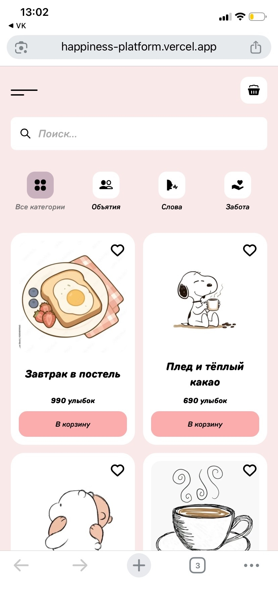
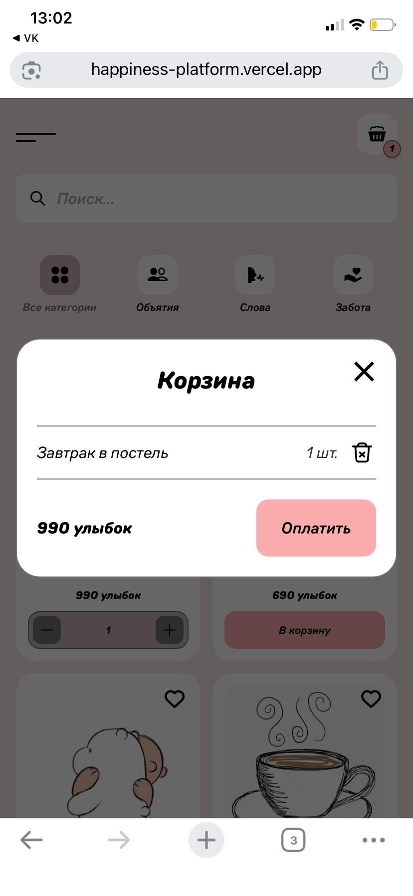
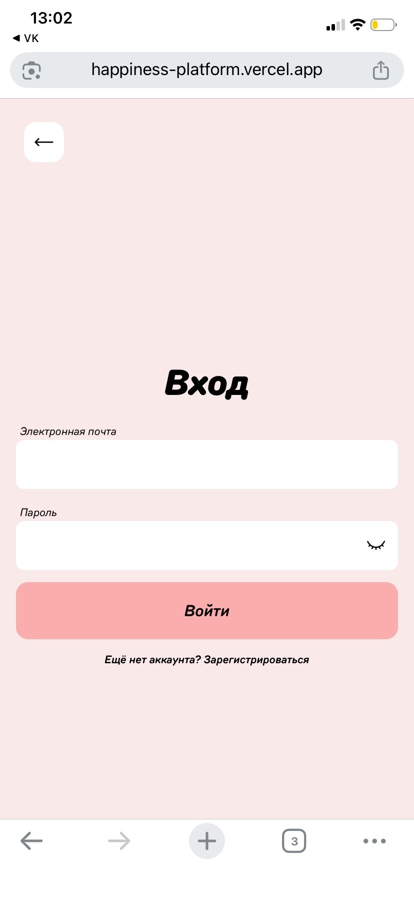
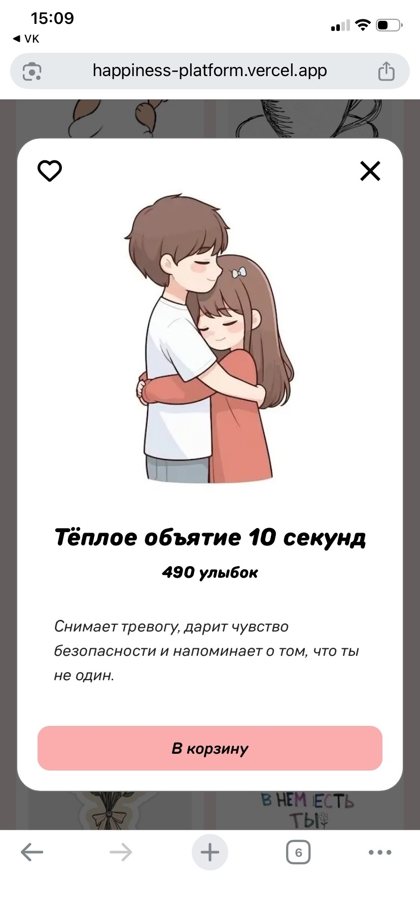

# # ❤️ Интернет-магазин счастья

## О проекте
Интернет-магазин счастья - это мобильное (пока что) веб-приложение, где пользователь за улыбки может приобрести что-то, что делает его счастливым. Это не материальные вещи, не деньги, это то, что греет душу. Приложение нацелено на помощь людям в тяжелый период. Все должны улыбаться и быть счастливы.

## 👀 Взгяд на проект

## 💻 Используемые технологии
* Next.js
* Supabase 
* React
* TypeScript
* SASS

## ✉️ Контакты автора

